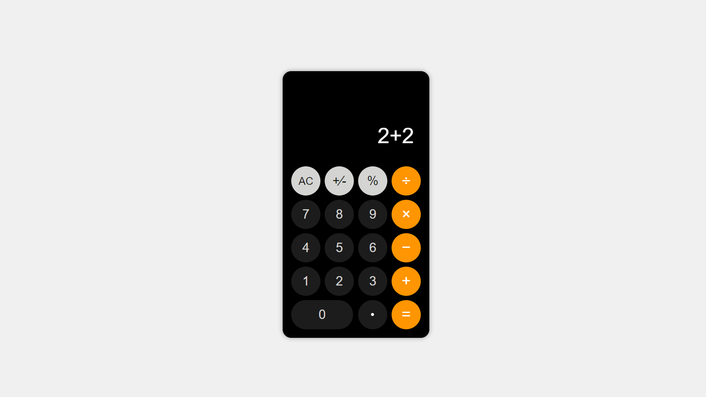
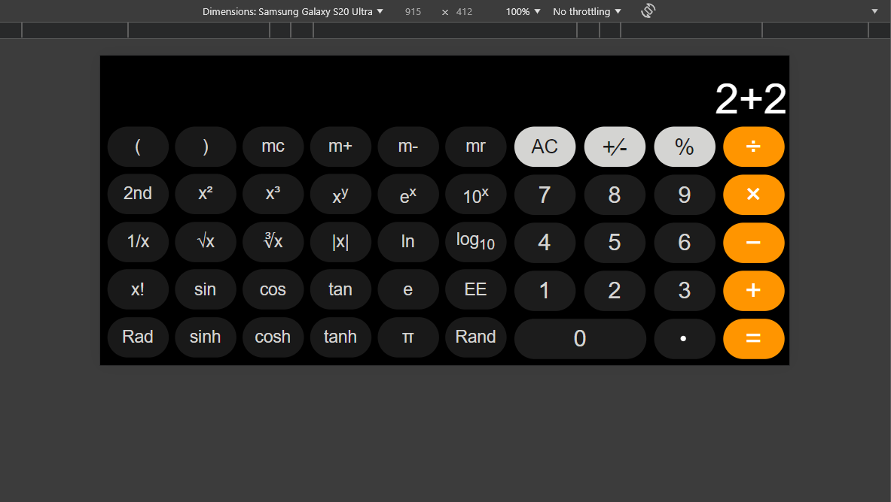

# JavaScript Calculator

This is a simple calculator application built using JavaScript, HTML, and CSS. It provides basic arithmetic operations and a user-friendly interface for performing calculations.


## Features

- **Basic Operations:** Addition, subtraction, multiplication, and division.
- **Clear Functionality:** Clear the input and reset the calculator.
- **Responsive Design:** Optimized for both desktop and mobile devices.

## Directory Structure

- `index.html`: The main HTML file containing the structure of the calculator.
- `styles.css`: The CSS file for styling the calculator.
- `script.js`: The JavaScript file containing the logic for the calculator operations.

## Usage

1. **Clone the Repository**

   ```bash
   git clone https://github.com/YourUsername/javascript-calculator.git
   cd javascript-calculator
   ```

2. **Open the Project**

   Open `index.html` in your browser to view and use the calculator.

## Example

Here’s how the calculator looks on different devices:

- **Desktop View:**
  
  

- **Mobile View:**

  

## How to Contribute

Contributions are welcome! To contribute:

1. Fork the repository.
2. Create a new branch for your feature or bug fix.
3. Commit your changes and push to your fork.
4. Open a pull request with a clear description of your changes.

## Technologies Used

- **HTML** 
- **CSS** 
- **JavaScript** 

## Connect with Me

I love connecting with new people and exploring new opportunities. Feel free to reach out to me through any of the
platforms below:

<table>
    <tr>
        <td>
            <a href="https://t.me/iqbolshoh_777">
                
            </a>
        </td>
        <td>
            <a href="https://instagram.com/iqbolshoh_777" target="blank"></a>
        </td>
        <td>
            <a href="https://wa.me/qr/22PVFQSMQQX4F1">
                
            </a>
        </td>
        <td>
            <a href="https://x.com/iqbolshoh_777">
                
            </a>
        </td>
        <td>
            <a href="https://www.linkedin.com/in/iqbolshoh/">
                
            </a>
        </td>
        <td>
            <a href="mailto:iilhomjonov777@gmail.com">
                
            </a>
        </td>
    </tr>
</table>
